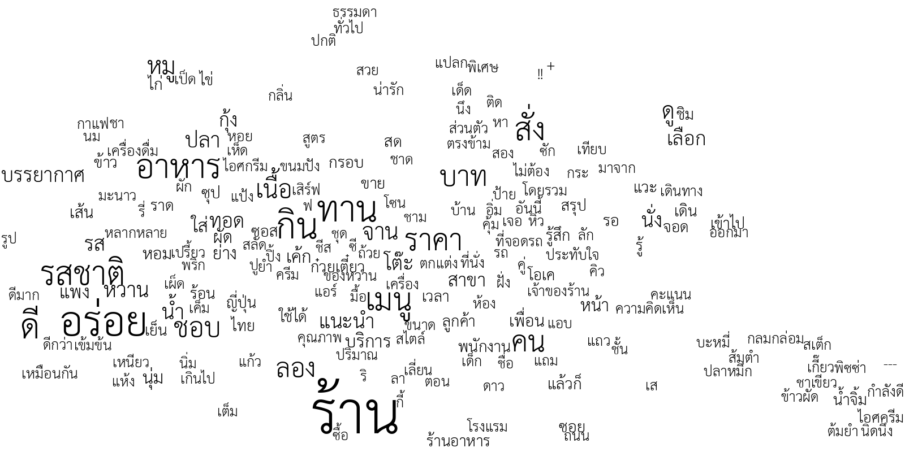
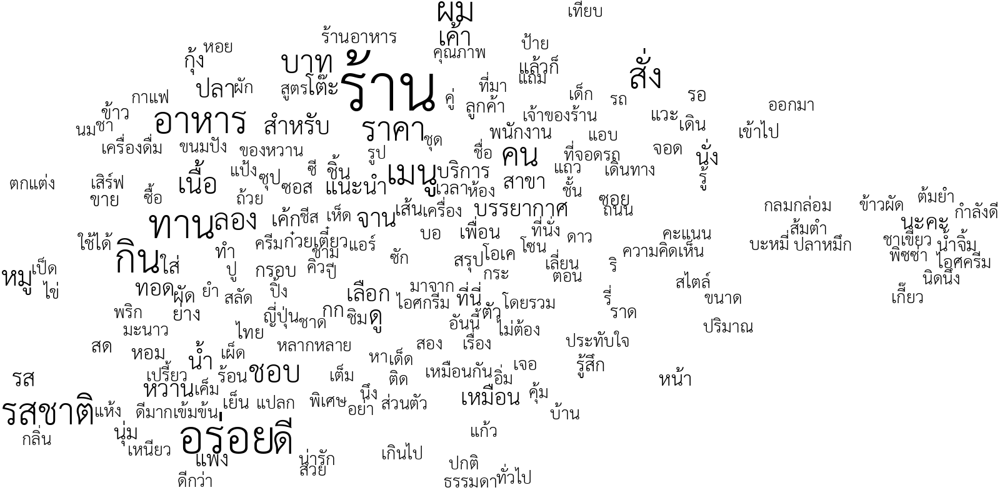
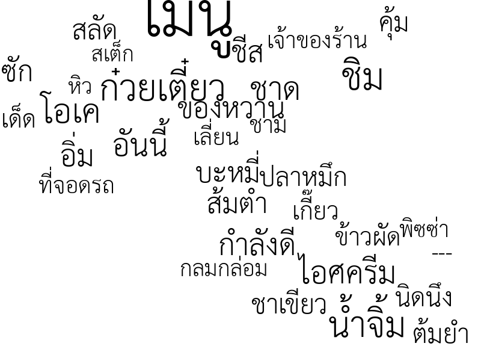
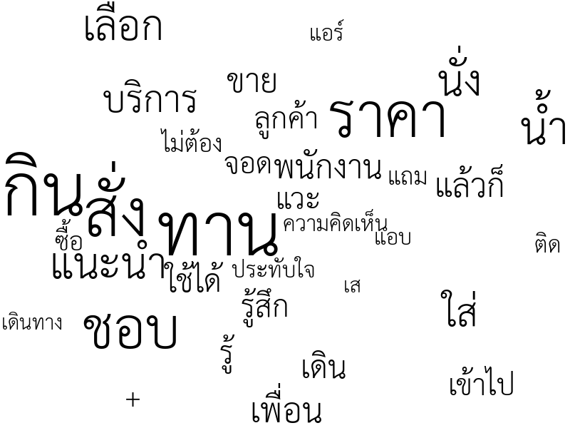
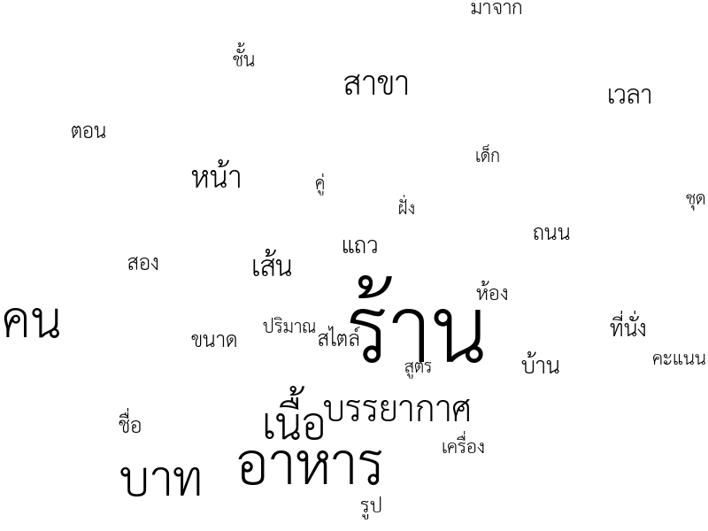
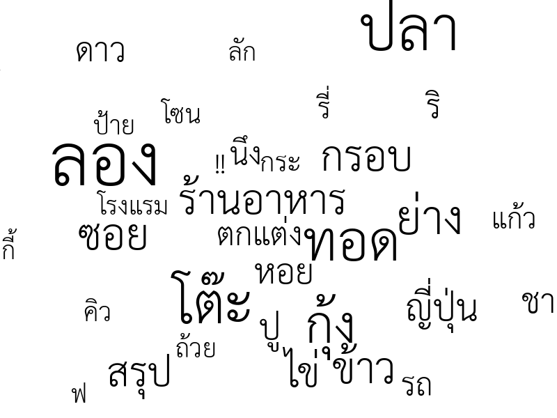
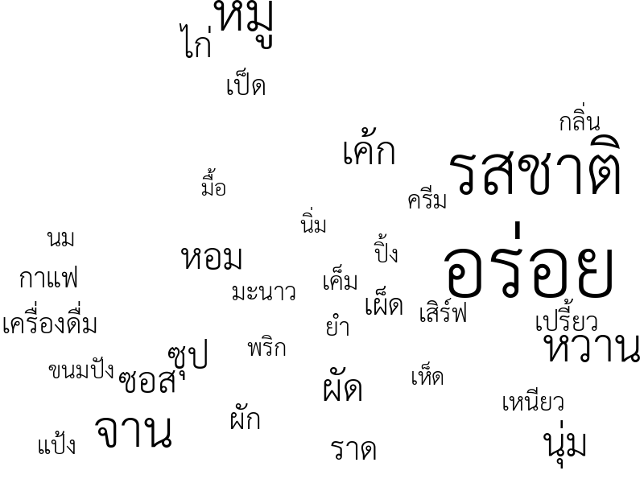
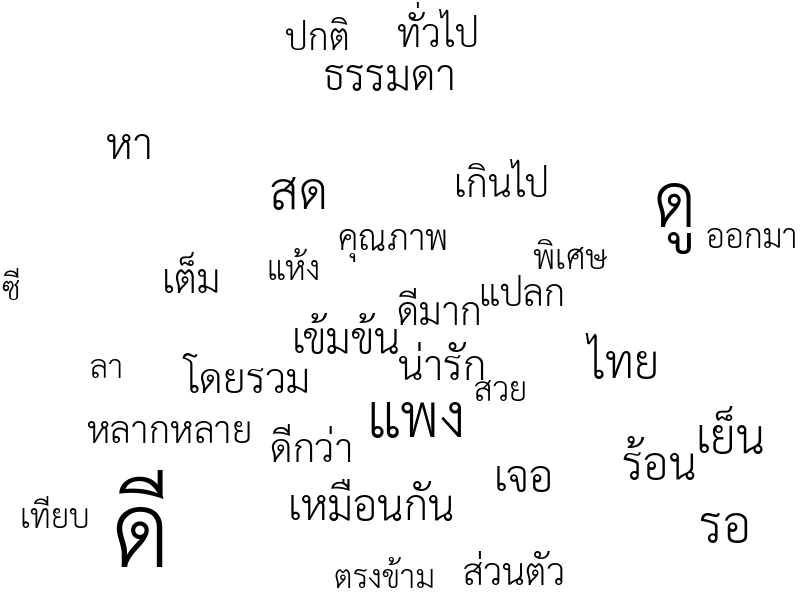
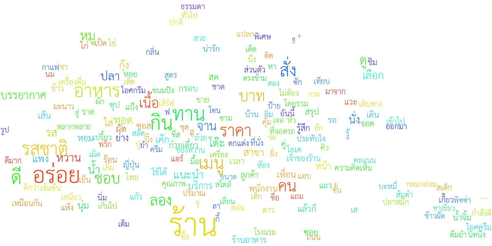

# **swordcloud**
`swordcloud`: A semantic word cloud generator that uses t-SNE and k-means clustering to visualize words in high-dimensional semantic space. Based on [A. Mueller's `wordcloud` module](https://github.com/amueller/word_cloud), `swordcloud` can generate semantic word clouds from Thai and English texts based on any word vector models.

## **Content**
1. [Installation](#installation)
2. [Usage](#usage)\
    2.1 [Initialize `SemanticWordCloud` instance](#initialize-semanticwordcloud-instance)\
    2.2 [Generate from Raw Text](#generate-from-raw-text)\
    2.3 [Generate from Word Frequencies](#generate-from-word-frequencies)\
    2.4 [Generate k-means Cluster Clouds](#generate-k-means-cluster-clouds)\
    2.5 [Recolor Words](#recolor-words)\
    2.6 [Export Word Clouds](#export-word-clouds)
3. [Color "Functions"](#color-functions)

## **Installation**
`swordcloud` can be installed using `pip`:
```
pip install swordcloud
```
Optionally, if you want to be able to embed fonts directly into [the generated SVGs](#export-word-clouds), an `embedfont` extra can also be specified:
```
pip install swordcloud[embedfont]
```
As of **version 0.0.9**, the exact list of dependencies is as follow:
- `python >= 3.8`
- `numpy >= 1.21.0`
- `pillow`
- `matplotlib >= 1.5.3`
- `gensim >= 4.0.0`
- `pandas`
- `pythainlp >= 3.1.0`
- `k_means_constrained`
- `scikit-learn`
- (optional) `fonttools`

## **Usage**
All code below can also be found in [the example folder](example).
### **Initialize `SemanticWordCloud` instance**
For most use cases, the `SemanticWordCloud` class is the main API the users will be interacting with.
```python
from swordcloud import SemanticWordCloud
# See the `Color "Functions"` section for detail about these color functions
from swordcloud.color_func import SingleColorFunc

wordcloud = SemanticWordCloud(
    language = 'TH',
    width = 1600,
    height = 800,
    max_font_size = 150,
    prefer_horizontal = 1,
    color_func = SingleColorFunc('black')
)
```
Please refer to the documentation in [src/swordcloud/wordcloud.py](src/swordcloud/wordcloud.py) or in your IDE for more detail about various options available for customizing the word cloud.
### **Generate from Raw Text**
```python
# Can also be one large string instead of a list of strings
raw_text = list(map(str.strip, open('raw_text.txt', encoding='utf-8')))

wordcloud.generate_from_text(raw_txt, random_state=42)
```

### **Generate from Word Frequencies**
```python
freq = {}
for line in open("word_frequencies.tsv", encoding="utf-8"):
    word, count = line.strip().split('\t')
    freq[word] = int(count)

wordcloud.generate_from_frequencies(freq, random_state=42)
```

### **Generate k-means Cluster Clouds**
```python
wordcloud = SemanticWordCloud(
    language = 'TH',
    # make sure the canvas is appropriately large for the number of clusters
    width = 2400,
    height = 1200,
    max_font_size = 150,
    prefer_horizontal = 1,
    color_func = SingleColorFunc('black')
)

wordcloud.generate_from_text(raw_text, kmeans=6)
# Or directly from `generate_kmeans_cloud` if you already have word frequencies
wordcloud.generate_kmeans_cloud(freq, n_clusters=6)

# Each sub cloud can then be individually interacted with
# by accessing individual cloud in `sub_clouds` attribute
for cloud in wordcloud.sub_clouds:
    ...
```
||||
-|-|-
||
||
### **Recolor Words**
```python
# If the generated colors are not to your liking
# We can recolor them instead of re-generating the whole cloud
from swordcloud.color_func import RandomColorFunc
wordcloud.recolor(RandomColorFunc)
```

### **Export Word Clouds**
- As `pillow`'s `Image`
```python
img = wordcloud.to_image()
```
- As image file
```python
wordcloud.to_file('wordcloud.png')
```
- As SVG
```python
# Without embedded font
svg = wordcloud.to_svg()
# With embedded font
svg = wordcloud.to_svg(embed_font=True)

# Note that in order to be able to embed fonts
# the `fonttools` package needs to be installed
```
- As `numpy`'s image array
```python
array = wordcloud.to_array()
```

## **Color "Functions"**
A number of built-in color "functions" can be accessed from  `swordcloud.color_func`:
```python
from swordcloud.color_func import <your_color_function_here>
```
The list of available functions is as follow:
- `RandomColorFunc` (Default)\
    Return a random color.
- `ColorMapFunc`\
    Return a random color from the user-specified [`matplotlib`'s colormap](https://matplotlib.org/stable/gallery/color/colormap_reference.html).
- `ImageColorFunc`\
    Use a user-provided colored image array to determine word color at each position on the canvas.
- `SingleColorFunc`\
    Always return the user-specified color every single time, resulting in every word having the same color.
- `ExactColorFunc`\
    Use a user-provided color dictionary to determine exactly which word should have which color.

All the above functions, **except** `RandomColorFunc` which cannot be customized further, must be initialized before passing them to the `SemanticWordCloud` class. For example:
```python
from swordcloud.color_func import ColorMapFunc
color_func = ColorMapFunc("magma")
wordcloud = SemanticWordCloud(
    ...
    color_func = color_func
    ...
)
```
Users can also implement their own color functions, provided that they are callable with the following signature:

**Input**:
- `word: str`\
    The word we are coloring
- `font_size: int`\
    Font size of the word
- `position: tuple[int, int]`\
    Coordinate of the top-left point  of the word's bounding box on the canvas
- `orientation: int`\
    [`pillow`'s orientation](https://pillow.readthedocs.io/en/stable/reference/Image.html#transpose-methods).
- `font_path: str`\
    Path to the font file (OTF or TFF)
- `random_state: random.Random`\
    Python's `random.Random` object

**Return**:\
Any object that can be interpreted as a color by `pillow`. See [`pillow`'s documentation](https://pillow.readthedocs.io/en/stable/) for more detail.

Internally, arguments to color functions are always passed as keyword arguments so they can be in any order. However, if your functions only use some of them, make sure to include `**kwargs` at the end of your function headers so that other arguments do not cause an error.